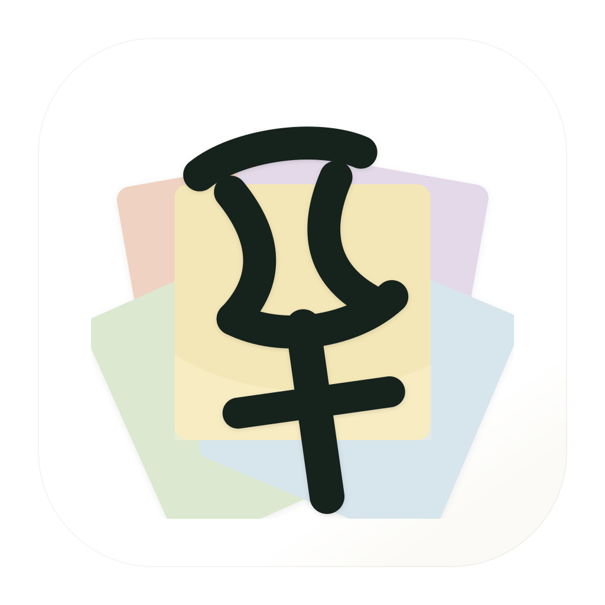

<p align="center">
  
</p>

# Pin It

Pin it, so your AI can use it later.

Pin It is a local desktop pinboard for saving text, tables, code, links, and
screenshots while you work. When something becomes useful again, you can copy
it directly or bring it into an MCP-capable AI client.

[Download for Mac](https://get-pin-it.vercel.app/download.html) ·
[Star on GitHub](https://github.com/johnnyzhoujz/pin-it-public)

> [!IMPORTANT]
> Pin It is an early macOS-first project. Public installers are Developer ID
> signed and notarized by Apple for both Apple silicon and Intel Macs.

> [!NOTE]
> Version 0.2.6 uses a new brand-neutral macOS application identity. When
> upgrading from 0.2.5 or earlier, install the new DMG and grant macOS privacy
> permissions again. Existing pins remain in the same local data directory.
> Automatic updates resume normally after 0.2.6 is installed.

## What it does

- Pin the clipboard with `Command+Shift+I`.
- Pin a screen region with `Command+Shift+O`.
- Organize pins into multiple local boards.
- Save text, Markdown, code, HTML tables, links, and images.
- Search, reorder, edit, archive, and delete pins.
- Copy selected material as a deterministic Markdown packet.
- Read pins from MCP-capable clients through the bundled read-only server.

## Privacy

Pins and images stay on your computer. Pin It has no account system, cloud
sync, telemetry, or remote pin storage.

Automatic title generation is optional. If you enable it and configure an OpenAI API key,
Pin It calls the OpenAI API with your key after a pin is saved locally. It sends
a capped excerpt for text pins or the captured image for image pins. Without a
key, Pin It uses local fallback titles and sends nothing to OpenAI.

The API key is stored in macOS Keychain. On other supported Electron platforms,
Pin It uses Electron's encrypted storage when it is available.

## Requirements

- macOS for the complete capture experience
- Node.js 22 or newer
- npm

## Run from source

```sh
git clone https://github.com/johnnyzhoujz/pin-it-public.git
cd pin-it-public
npm ci
npm run desktop
```

Development builds use isolated local storage and do not modify data from the
installed production app.

Build the two packaged channels separately:

```sh
npm run pack:mac:prod
npm run pack:mac:dev
```

Production is written to `release/mac-arm64/Pin It.app`; development is
written to `release-dev/mac-arm64/Pin It Dev.app`.

The renderer is also available on `http://127.0.0.1:5173/` while the desktop
development process is running.

To run the development channel against production-built renderer assets:

```sh
npm run desktop:prod
```

## Local data

Pin data is stored under Electron's app-data directory. The directory still
uses the project's former name so existing local data survives the rename:

```text
~/Library/Application Support/Keep That/keeps.json
~/Library/Application Support/Keep That/images/
```

`keeps.json` stores relative image paths and `pinit://pin/<id>/image`
placeholders rather than inline base64 payloads.
Development data is isolated at
`~/Library/Application Support/Pin It Dev/keeps.json`.

## MCP

Pin It includes a read-only MCP server. It can list and search pins, retrieve
image pins, and generate deterministic packets.

Each packaged channel configures its own MCP entry automatically for Codex,
Claude Code, and Cursor on launch. It also updates Claude Desktop when that
app is installed.
Existing MCP servers and client-specific Pin It settings are preserved, stale
Pin It paths are repaired, and a timestamped backup is created before an
existing config file changes. If a JSON config is malformed, Pin It leaves it
untouched and continues launching.

Automatic setup updates these user-level files:

```text
~/.codex/config.toml
~/.claude.json
~/.cursor/mcp.json
~/Library/Application Support/Claude/claude_desktop_config.json
```

Running Pin It from source does not modify MCP client configuration.
Clients may still require a restart or first-use approval before loading a new
local MCP server; Pin It does not bypass those client security checks.

Build and test the server:

```sh
npm run build:mcp
node dist-mcp/pinit-mcp.mjs --selftest
```

Example configuration for a repository checkout:

```json
{
  "mcpServers": {
    "pin-it-dev": {
      "command": "<absolute-path-to-node>",
      "args": ["<absolute-path-to-repo>/dist-mcp/pinit-mcp.mjs"],
      "env": {
        "PINIT_MCP_SERVER_NAME": "pin-it-dev",
        "PINIT_STORE_PATH": "~/Library/Application Support/Pin It Dev/keeps.json"
      }
    }
  }
}
```

Example configuration for a locally packaged app:

```json
{
  "mcpServers": {
    "pin-it": {
      "command": "/Applications/Pin It.app/Contents/MacOS/Pin It",
      "args": [
        "/Applications/Pin It.app/Contents/Resources/app.asar.unpacked/dist-mcp/pinit-mcp.mjs"
      ],
      "env": {
        "ELECTRON_RUN_AS_NODE": "1",
        "PINIT_MCP_SERVER_NAME": "pin-it",
        "PINIT_STORE_PATH": "~/Library/Application Support/Keep That/keeps.json"
      }
    }
  }
}
```

The Settings panel shows the resolved configuration for the current
app/session as a manual fallback for other MCP clients.

### Reliable MCP testing

Use fixtures for automated MCP tests; never point them at the real Pin It
store. The source test exercises the complete MCP protocol surface:

```sh
npm run test:mcp
```

After packaging, test the exact signed app binary, its bundle identity,
automatic client configuration, server handshake, tools, resources, images,
and packets:

```sh
npm run test:mcp:packaged:dev
npm run test:mcp:packaged:prod
npm run test:mcp:installed:prod
```

Once production is installed, verify both channels together with:

```sh
npm run test:mcp:channels
```

Both packaged tests create temporary config homes and stores, then delete
them. For the final end-to-end client check, install production at
`/Applications/Pin It.app`, launch it once, restart the MCP client, and verify:

```sh
codex mcp list
claude mcp get pin-it
```

Cursor may require its normal first-use approval for a new local MCP server.

## Generate titles for each pin

Automatic title generation is opt-in. Add an OpenAI API key in Settings, or provide it only
to the development process:

```sh
OPENAI_API_KEY=... npm run desktop
```

Captured content is saved immediately with a local title before any provider
request runs. Provider failures leave the local title unchanged, and a
generated title never overwrites a title you edited manually.

## Validate changes

Run the complete local check:

```sh
npm run check
```

Or run the steps separately:

```sh
npm run audit:prod
npm test
npm run build
```

## Create a local macOS build

Create an unpacked development app:

```sh
npm run pack:mac
```

Create local `.dmg` and `.zip` artifacts:

```sh
npm run dist:mac
```

Generated artifacts are written to `release/` and are excluded from Git.
Official public artifacts are built from a version tag, Developer ID signed,
notarized by Apple, and published with checksums in GitHub Releases. A local
build without the release credentials is only for local testing.

## Project layout

```text
electron/   Electron main process, preload bridge, updater, and MCP entrypoint
src/        React renderer and local pinboard behavior
tests/      Node and Vitest regression coverage
site/       Static marketing site deployed to Vercel
build/      App icons and tracked brand resources
docs/       Product and engineering design notes
```

## Contributing

Bug reports and focused pull requests are welcome. Read
[CONTRIBUTING.md](CONTRIBUTING.md) before starting. Please report security
issues according to [SECURITY.md](SECURITY.md), not through a public issue.

## License

Pin It is available under the [MIT License](LICENSE).
